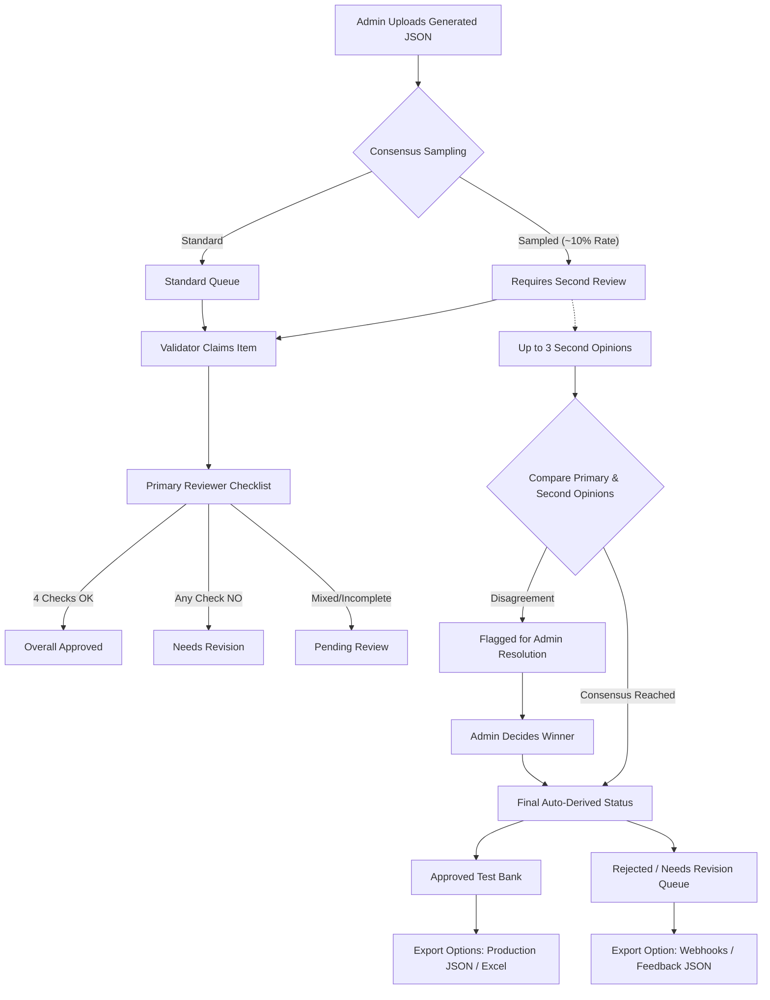

# 🎯 SAT Test Bank Curation & Validation Portal

An enterprise-grade, web-based reviewer portal for auditing, validating, and curating AI-generated SAT (Reading & Writing, Math) question banks. This application bridges the gap between raw AI pipeline generation and verified production-ready test banks by offering multi-reviewer consensus workflows, real-time sync, atomic database-level state locking, and rich interactive analytics.

---

## 🏗️ System Architecture & Workflow

Below is the workflow of a question item through the validation lifecycle:



---

## ✨ Key Features

### 👤 Role-Based Access Control (RBAC) (Spec §2)
* **Lead Validator (Admin)**: Full system access. Upload files, manage invites and user roles, override status parameters, configure rejection webhooks and consensus sample rates, resolve consensus disagreements, and clear/wipe the workspace.
* **Validator (Reviewer)**: Perform primary checklist reviews, claim items, add threaded comments, and submit independent second opinions on consensus-tracked items.
* **Auditor (Read-Only)**: QA & compliance role. Full read-only visibility into dashboard, questions, logs, and exports. All mutation features (checklist, edits, comments, claims) are completely gated.

### 🔒 Atomic Claim Locking & Real-Time Sync (Spec §3, §7)
* **Race-Condition Protection**: Prevents double-claiming. Claiming a question is atomic at the database level (`claimed_by` updates *only if* it is currently `NULL`).
* **Supabase Real-Time**: Instant synchronization of claims, status changes, overrides, and comment threads across all active validator screens.
* **Security Idle Session Timeout**: Automatic sign-out after 30 minutes of user inactivity (mouse movement, clicks, keystrokes) to prevent unauthorized access.

### 📊 Consensus Validation & Inter-Rater Reliability (Spec §7)
* **Deterministic Consensus Sampling**: Automatically schedules a percentage of uploaded questions (configured in settings) for second-reviewer consensus based on a stable ID hash.
* **Double-Blind Review**: Secondary reviewers submit validation checklists independently without seeing the primary reviewer's findings.
* **Conflict Resolution**: Disagreements between the primary reviewer's verdict and the second-opinions majority are highlighted for Admin resolution.

### 🧐 Side-by-Side Duplicate Detection (Spec §6)
* Visual comparison modal showing the current question next to its close matches identified by the generation pipeline.
* Highlights the similarity score and highlights overlapping textual blocks.

### 📝 Threaded Question Comments (Spec §6)
* Threaded, timestamped, and validator-attributed comment histories replace standard static note fields. Helps maintain a robust feedback loop for revisions.

---

## 🛠️ Technology Stack

* **Frontend Framework**: React 19, TypeScript 5.8
* **Styling**: Tailwind CSS 4, Motion (Animation)
* **Icons**: Lucide React
* **Backend & Sync**: Supabase (Postgres, Realtime Channels, Row Level Security)
* **File Processing**: SheetJS (`xlsx` for Excel export)
* **Build System**: Vite 6

---

## 💾 Database Schema (`supabase/schema.sql`)

The backend is powered by 4 primary tables with strict **Row-Level Security (RLS)** policies:

| Table Name | Description | RLS Policy Details |
| :--- | :--- | :--- |
| `profiles` | Stores validator account settings, roles, and status. | Viewable by all authenticated users. Editable by owner or Admin. |
| `questions` | The main repository of SAT questions, checklists, overrides, and claims. | Select for all auth users. Insert/Delete for Admins. Update for all active users. |
| `audit_log` | Immutable append-only audit trail logging all reviewer operations. | Read by all auth users. Insert by active users. Update/Delete disabled. |
| `app_settings` | Configuration settings for webhooks and consensus sampling rates. | Read by all auth users. Update limited to Admins. |
| `validator_invites` | Pre-authorizations for new validator registrations. | View/Manage restricted to Admins. |

---

## ⚡ Setup & Installation

### 1. Clone & Install Dependencies
```bash
git clone <repository-url>
cd VALIDATOR_REVIEW_APP
npm install
```

### 2. Configure Environment Variables
Copy `.env.example` to `.env` and populate your Supabase project credentials:
```env
VITE_SUPABASE_URL=https://your-project-id.supabase.co
VITE_SUPABASE_ANON_KEY=your-supabase-anonymous-api-key
```

### 3. Initialize Database Schema
1. Go to your [Supabase Dashboard](https://supabase.com).
2. Open the **SQL Editor** tab.
3. Click **New Query** and copy-paste the entire contents of [schema.sql](file:///c:/JSON_VALIDATE/VALIDATOR_REVIEW_APP-main/supabase/schema.sql).
4. Click **Run** to build tables, triggers, auth-helpers, and RLS policies.
5. Create your own validator account in the Web App interface, then promote yourself to Admin by executing:
   ```sql
   UPDATE public.profiles SET role = 'admin' WHERE email = 'your-signup-email@example.com';
   ```

### 4. Run Development Server
```bash
npm run dev
```
Open [http://localhost:3000](http://localhost:3000) in your browser.

---

## 🚀 Review & Curation Workflow

1. **Upload Sets**: Admins upload one or more raw generated JSON arrays.
2. **Claim Items**: Reviewers browse pending questions and click **Claim Question** to lock it.
3. **Verify Components**: Fill in the **Validation Checklist** (Formation, Answer, Category, Difficulty).
4. **Offline Discussion**: If status needs revision, add comments detailing changes and reassign.
5. **Consensus**: Submit independent verdicts if prompted for consensus.
6. **Export**: Export finalized approved test banks in any of the supported formats.

---

## 📥 Supported Export Formats (Spec §10, §12)

Admins can download curated assets using three distinct channels:

### 1. Vetted Production Test Bank (`JSON`)
Formats approved items to match the exact schema consumed by the **MySAT AI Coach** production engine:
```json
[
  {
    "id": "sat-rw-cs-0001",
    "stem": "Which choice completes the text with the most logical and precise word or phrase?",
    "question_type": "mcq",
    "choices": { "A": "gradual", "B": "abrupt", "C": "predictable", "D": "welcome" },
    "correct_answer": "B",
    "explanation": "The passage sets up a contrast...",
    "category": "Craft and Structure",
    "sub_skill": "Words in Context",
    "difficulty": "medium",
    "passage": "The critic's review...",
    "stimulus": null,
    "image_url": null,
    "generator_run_id": "run-098",
    "status": "validated",
    "validated_at": "2026-07-19T17:00:00.000Z"
  }
]
```

### 2. Flat Excel Spreadsheets (`.xlsx`)
Generates flat sheets suitable for offline editing, data sharing with non-technical stakeholders, and bulk imports. The choice keys are parsed into dedicated columns, and consensus details are pre-summarized.

### 3. Pipeline Feedback Logs (`JSON`)
Exports only rejected questions, compiling all checklist errors and threaded reviewer comments. Perfect for sending back to LLM fine-tuning pipelines to prevent repeating mistakes.